## Introduction
---
> "Arguing that you don't care about the right to privacy because you have
> nothing to hide is no different from saying you don't care about free speech
> because you have nothing to say." – Edward Snowden

Almost everyday we hear about data breaches, enterprise and government hacks,
NSA backdoors in major proprietary operating systems, malware, spyware and
ransomware. Its also common nowadays to know someone that had his email hijacked
, or his intimate family vacation photos exposed to the wide public. If you're
not one of those people, you are extremely lucky, and if you are, you should
seriously ask yourself why?! Either way you must reconsider your privacy and
security choices, and learn a little bit of encryption basics and terminology
that will keep you safe and anonymous in todays Internet wild wild west.

Creating and maintaining your own encryption keys is a must-know skill for
anyone who's serious about their security and privacy. If you have sensitive
files on your harddrive, or surf the Internet on a daily basis then its a no
brainer. You don't have to know the intricate math details of how RSA or
Elliptical Curve algorithms work, but at least you should be familiar with how
good and effective the are against potential attackers.

## GNU Privacy Guard
---
> "GnuPG is a complete and free implementation of the OpenPGP standard as
> defined by RFC4880 (also known as PGP). GnuPG allows you to encrypt and sign
> your data and communications; it features a versatile key management system,
> along with access modules for all kinds of public key directories. GnuPG, also
> known as GPG, is a command line tool with features for easy integration with
> other applications. A wealth of frontend applications and libraries are
> available. GnuPG also provides support for S/MIME and Secure Shell (ssh)." --
> 

GnuPG is an excellent command line program that allows you to manage your
encryption keys. It is a comprehensive tool that enable you to create all sorts
of encryption keys using different military-grade algorithms. The keys you
generate with GnuPG can have different capabilities (**C**eritify, **S**ign,
**A**uthenticate, **E**ncrypt). Keys can have multiple capabilities; however,
the best practice is to create one key for each capability. Each key and/or
subkey is a pair of public and private certificates. For example, an **Encrypt**
capable key has a public and private certificates, together they constitute the
encryption key.

## Key Capabilities
---
Each capability defines what a key can do.

* The **Certify** key is usually the master key. It can create and certify other
    subkeys. The sole purpose of the certify key is to create other subkeys. You
    **DO NOT** use it to sign, authenticate or encrypt files and/or communications.
    If this key gets compromised, your entire keychain gets compromised. This
    key is usually long-lived, some where between 3 to 7 years.

* The **Sign** key is a subkey concerned only with signing files and messages.
    Just like your bank signature, a digital signature is a guarantee that the
    sender of the message is who he claims to be. You use the sign key to sign
    communications and files prior to sending them to recipients in order for
    them to verify that it was indeed you who sent the message and/or
    own the file. This is a 2 way process where senders and receivers have each
    others public sign keys and use them accordingly in each communication to
    make sure both parties are indeed the intended ones. This subkey is usually
    short-lived, ideally for 1 year.

* The **Authenticate** key is a subkey to authenticate against well-known
    protocols; such as, SSH, Git, TLS, etc. For example, when you share your
    authenticate subkey public certificate with GitHub you will not need to
    authenticate with username and password every time you push or pull code.
    This key is usually short-lived, ideally for 1 year.

* The **Encrypt** key is a subkey to encrypt/decrypt files and communications.
    Encryption is the process of changing a file's original low-level
    representation of 0s and 1s into a different representation then sending it
    to the recipient. This way if an encrypted file or communication is hijacked
    by unwanted parties, they will never be able to read its content unless they
    have the required decryption private key. This key is usually short-lived,
    ideally for 1 year.

When sending/receiving files and communications with different recipients we
only share with them our public keys and they share with us their public keys.
This way if I want to send an encrypted file to Ahmed, I first have to ask Ahmed
for their public key which I will use to encrypt the message. Then when the
message reaches Ahmed he can then use his private key to decrypt and read the
contents of that message. This is called **Asymmetric Cryptography** or
**Public-Key Cryptography**.

## What is ED25519?
---
ED25519 is a public-key cryptographic algorithm used for digital signature
generation and verification. It is based on the elliptic curve cryptography and
is considered more secure than other commonly used algorithms; such as, RSA and
DSA. An ED25519 key pair consists of private key and a corresponding public key.
The private key is used to generate digital signatures, while the public key is
used to verify the signatures.

The ED25519 algorithm is based on the elliptic curve defined over the prime
field \(2^{255}-19\). The private key is 256-bit integer, while the public key
is a 32-byte sequence.

## Generate a Master Key (Certify)
---
Run the `gpg` command with the following arguments. Choose option 11 to
create an ED25519 key to set your own capabilities for each key.

```bash
$ gpg --full-gen-key --expert
```
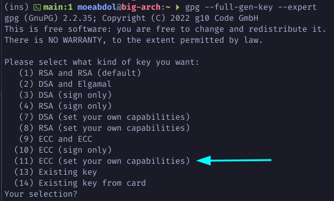

Toggle off the sign `S` and authenticate `A` capability to make sure the master
key is certify only.

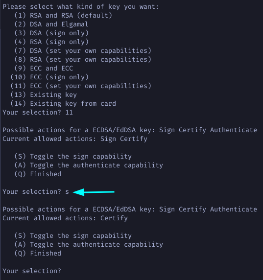

Choose `Q` to finalize the capabilities then choose `1` for Curve 25519 and set
the expiration of you master key. Enter your real name and password to set the
`uid` user identity to this key.

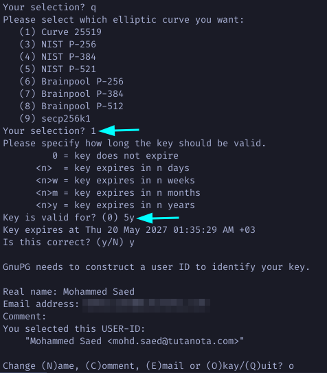

Choose `O` for Okay then type in a strong password to protect the key, and
voila your master key is created.

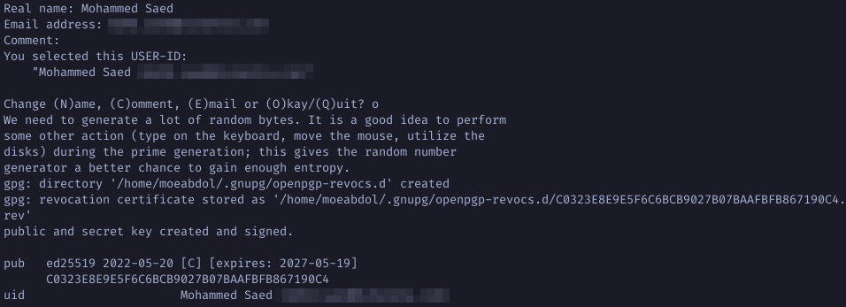

**Note**: Your master key has been created and using it now, you can create and
certify subkeys. Contrary to older versions, gpg now automatically creates a
revokation certificate for your keys.

## Generate Subkeys (Sign, Authenticate, and Encryption)
---
Run the following command to list your public keys. Copy your key id to be used
in the next step.

```bash
$ gpg -k
```
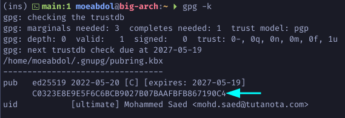

Run the following to edit you master key and add subkeys. Type addkey to add a
new subkey. Choose 11 to create an ED25519 subkey.

```bash
$ gpg --expert --edit-key YOUR-MASTER-KEY-ID
```
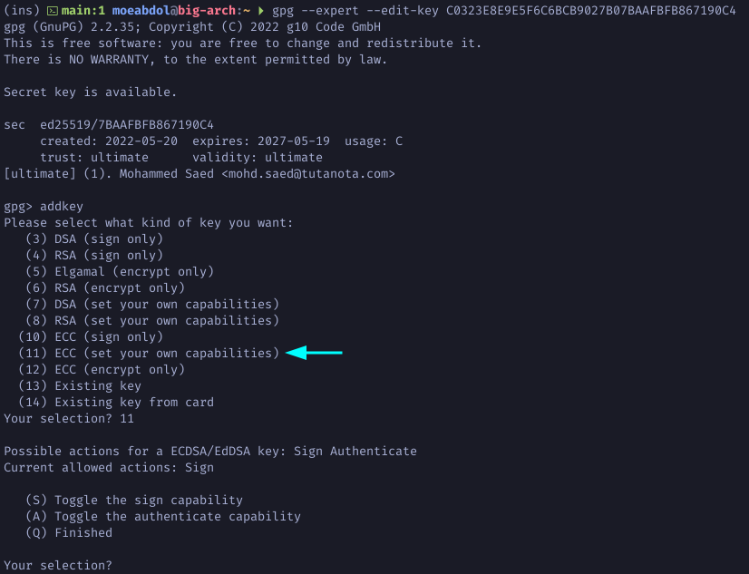

Make sure the Sign capability is on to create a sign subkey only. Choose 1 for
ED25519 subkey and define the expiration.

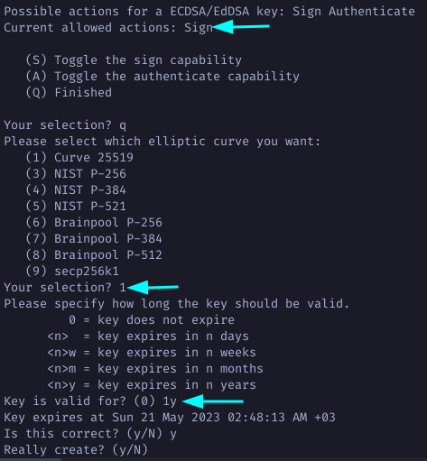

Note how the newly generated subkey is sign only.

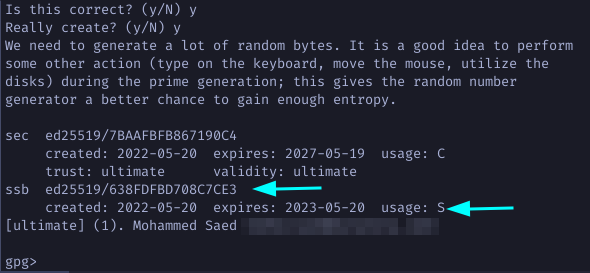

Continue by creating another subkey with authenticate only capability.

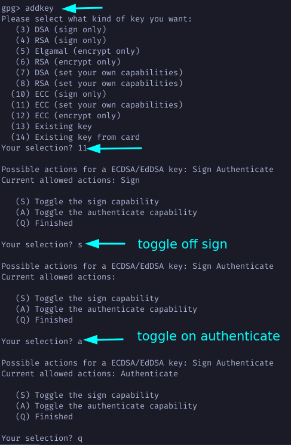

Again choose 1 for Curve 25519. Define an expiration period and note how your
new subkey is authenticate only.

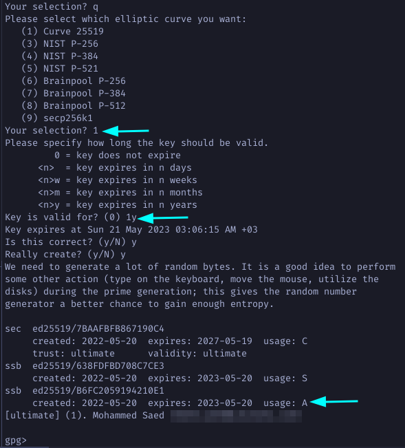

For the last subkey type `addkey` and this time choose 12 to create an
encryption only Curve 25519 subkey.

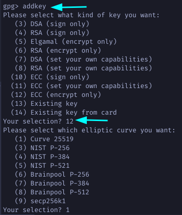

Define an expiration period and agree to the remaining questions.

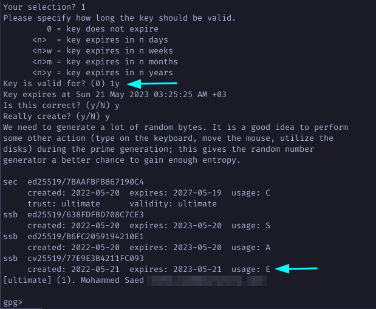

Finaly, type in `save` to save all your newly generated subkeys. Now list all
your keys.

```bash
$ gpg -k
```
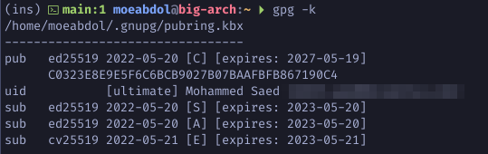
